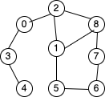
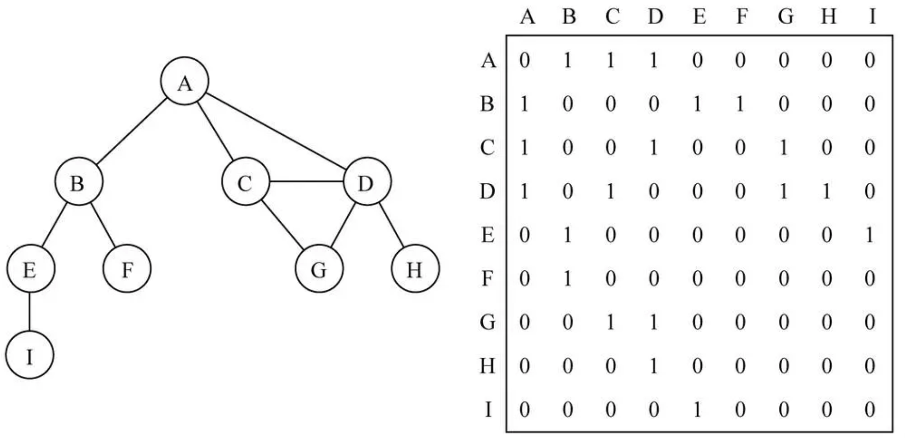
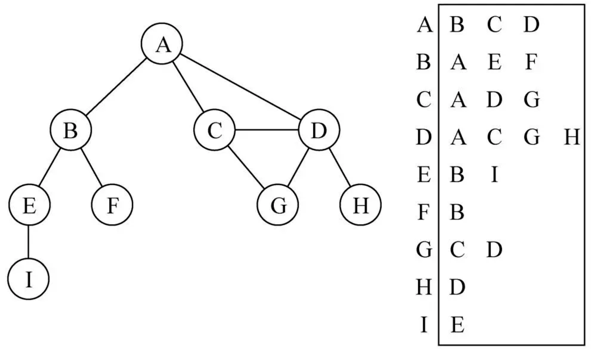

###### 什么是图

- 图是与树类似的一种数据结构
- 图由什么构成
  - 一组顶点:通常是 V(vertex)表示顶点的集合
  - 一组边:通常是 E(Edge)表示的集合
  - 边是顶点和顶点的连线
  - 边可以是有向的也可以是无向的

图的术语

    

- 顶点:图中的一个结点
- 边:表示顶点和顶点之间的连线
- 相邻顶点:一条边连接在一起的顶点称为相邻顶点
- 度:一个顶点的度是相邻顶点的数量
- 路径:
  - 路径是顶点的一个连续序列,比如上图的 2,1,5 就是一条路径
- 无向图:边没有方向
- 有向图:边是带有方向的

###### 图的表示

- 邻接矩阵:
  - 如果是一个无向图,矩阵展示的二维数组应该是对称的
  - 如果图是一个稀疏图,存储效率不高

- 邻接表
  - 邻接表由图中每个顶点以及和顶点相邻的顶点列表组成。
  - 这个列表有很多中方式来存储：数组/链表/字典(哈希表)都可以

###### 图的遍历

- 广度优先搜索(Breadth-First Search)
  - 基于队列,入队列的顶点先被探索
- 深度优先搜索(Depth-First Search)
  - 基于栈,将顶点存入栈中,顶点沿着路径探索,存在相邻的顶点就去访问
- 保证算法的效率: 每个顶点至多访问两次,可以用三种颜色反应各个顶点的状态
