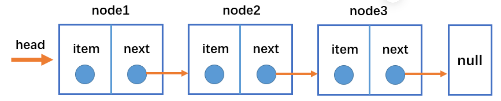
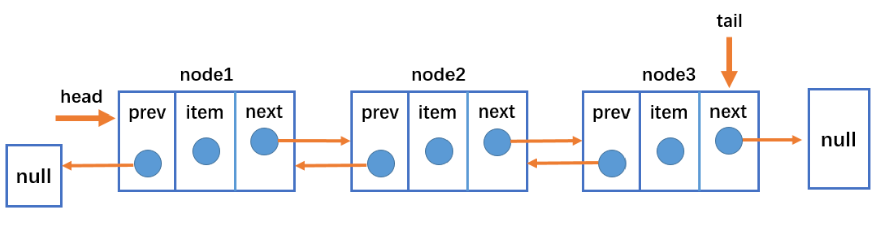

### 认识链表

---

###### 链表和数组

链表和数组一样,可以存放一系列的元素,但是实现的机制完全不同

- 数组
  - 存储多个元素，数组（或列表）可能是最常用的数据结构。
  - 几乎每一种编程语言都有默认实现数组结构, 这种数据结构非常方便，提供了一个便利的 `[]`语法来访问它的元素
  - 缺点:
    - 数组的创建通常需要申请一段连续的内存空间(一整块的内存), 并且大小是固定的所以当当前数组不能满足容量需求时, 需要扩容. (一般情况下是申请一个更大的数组, 比如 2 倍. 然后将原数组中的元素复制过去)
- 链表
  - 存储多个元素, 另外一个选择就是使用链表
  - 不同于数组, 链表中的元素在内存中不必是连续的空间
  - 链表的每个元素由一个存储元素本身的节点和一个指向下一个元素的引用(有些语言称为指针或者链接)组成
  - 优点
    - 内存空间不是比是连续的
    - 链表不必在创建时就确定大小, 并且大小可以无限的延伸下去
    - 插入删除数据的时候时间复杂度 O(1)
  - 缺点
    - 链表访问任何一个位置的元素时, 都需要从头开始访问,无法通过下标直接访问元素

### 单向链表

---

head 属性指向链表的第一个节点。
链表中的最后一个节点指向、 `null`。 当链表中一个节点也没有的时候，head 直接指向 `null`。

- 只能从头遍历到尾或者从尾遍历到头（一般从头到尾）
- 链表相连的过程是单向的，实现原理是上一个节点中有指向下一个节点的引用

### 双向链表

---

- 可以从头遍历到尾，也可以从尾遍历到头
- 链表相连的过程是双向的。实现原理是一个节点既有向前连接的引用，也有一个向后连接的引用
- 有效解决单向列表不能向前找数据的问题,所占的内存空间稍微大一点

