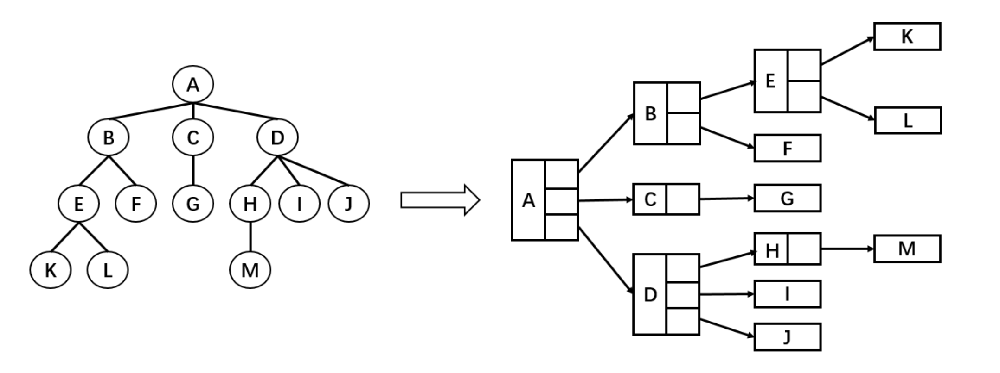
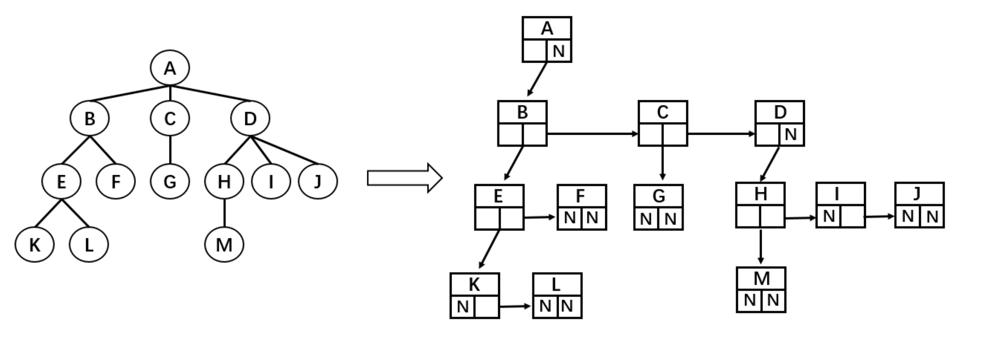
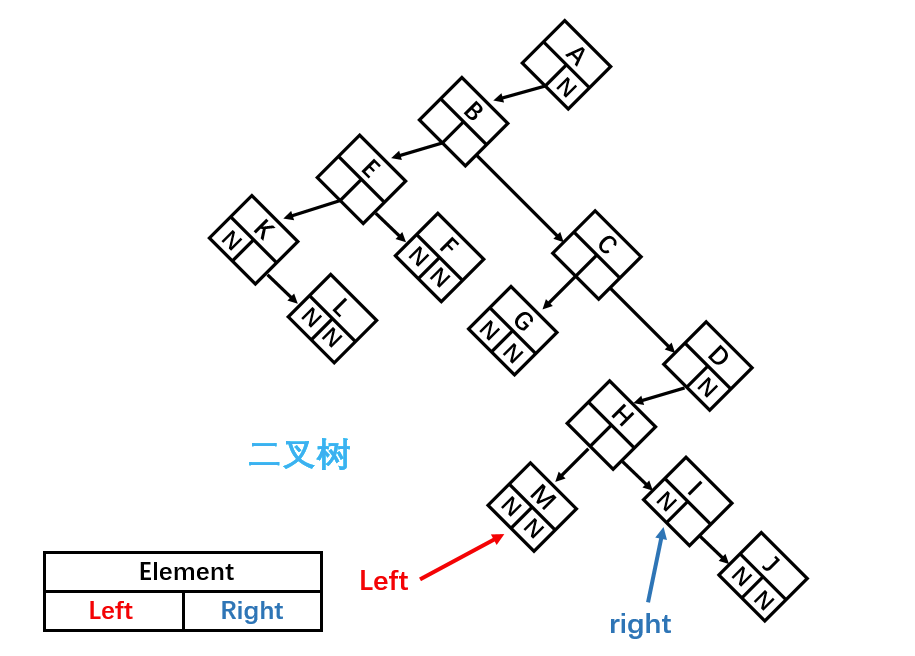
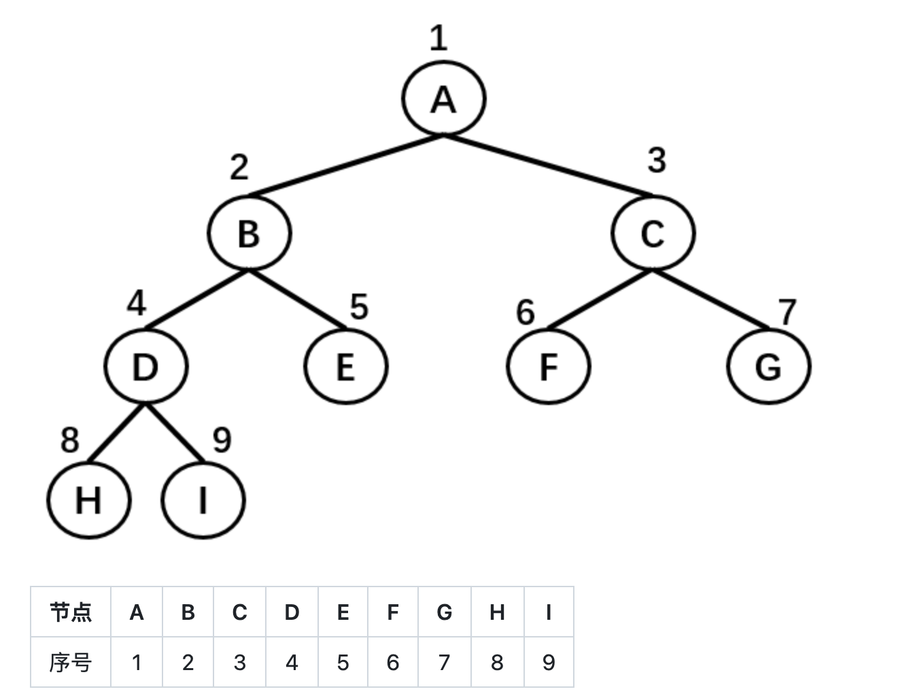
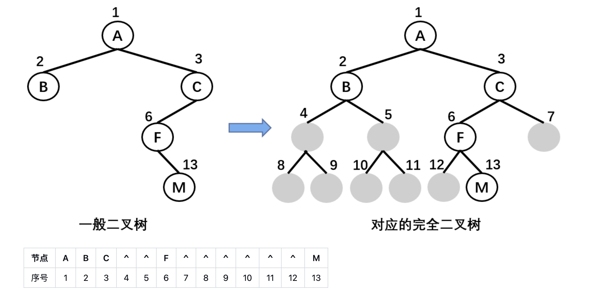
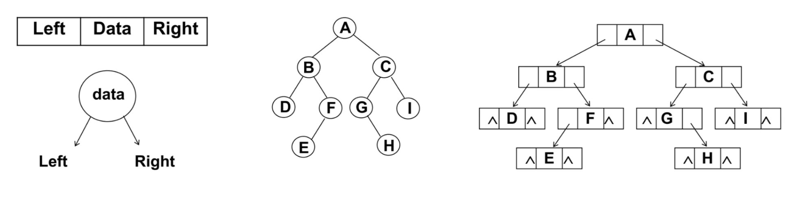

### 树结构

---

###### 树结构对比数组/哈希/链表有什么优势

数优点:可以通过下标进行访问,效率高

- 缺点:查找数据的时候需要对数据进行排序,生成有序的数组才能提高效率,并且插入和删除操作需要大量的位移

链表

- 优点:插入和删除效率较高
- 缺点:查找效率比较低,需要从头或者尾来进行查找,需要在表中间的位置进行操作的时候,效率不高

哈希表

- 优点:插入,查询,删除效率都较高
- 缺点:空间利用率不高,并且是元素无序的,不能拿到最大值,最小值等特殊值

树结构

- 优点:树结构综合了上述三种结构的优点，同时也弥补了它们存在的缺点（虽然效率不一定都比它们高），比如树结构中数据都是有序的，查找效率高；空间利用率高；并且可以快速获取最大值和最小值等

树的常用术语

- 节点的度（Degree）：节点的子树个数，比如节点 B 的度为 2
- 树的度：树的所有节点中最大的度数，如上图树的度为 2
- 叶节点（Leaf）：度为 0 的节点（也称为叶子节点），如上图的 H，I 等
- 父节点（Parent）：度不为 0 的节点称为父节点，如上图节点 B 是节点 D 和 E 的父节点
- 子节点（Child）：若 B 是 D 的父节点，那么 D 就是 B 的子节点
- 兄弟节点（Sibling）：具有同一父节点的各节点彼此是兄弟节点，比如上图的 B 和 C，D 和 E 互为兄弟节点
- 路径和路径长度：路径指的是一个节点到另一节点的通道，路径所包含边的个数称为路径长度，比如 A->H 的路径长度为 3
- 节点的层次（Level）：规定根节点在 1 层，其他任一节点的层数是其父节点的层数加 1。如 B 和 C 节点的层次为 2
- 树的深度（Depth）：树种所有节点中的最大层次是这棵树的深度，如上图树的深度为 4

###### 树结构的表示方式

- 最普通的表示方式

  

  树结构的组成方式类似于链表，都是由一个个节点连接构成。不过，根据每个父节点子节点数量的不同，每一个父节点需要的引用数量也不同。比如节点 A 需要 3 个引用，分别指向子节点 B，C，D；B 节点需要 2 个引用，分别指向子节点 E 和 F；K 节点由于没有子节点，所以不需要引用

- 儿子兄弟表示法

  

  这个表示法可以让每一个节点的引用的数量都是确定的

- 儿子兄弟表示法旋转 45 度

  

  这样子就成为了一颗二叉树,任何一颗树都可以通过二叉树模拟

###### 二叉树

- 二叉树的概念:如果树的每一个节点最多只能有两个节点,就称为二叉树
- 二叉树的组成:二叉树可以为空,若二叉树不为空,则它由根节点和称为其左子树 TL 和右子树 TR 的两个不相交的二叉树组成
- 二叉树的特性:
  - 一个二叉树的第 i 层的最大节点树为:2^(i-1), i >= 1
  - 深度为 k 的二叉树最大节点总数为:2^k - 1, k >= 1
  - 任何非空二叉树 T，若 n0 表示叶结点的个数、n2 是度为 2 的非叶结点个数，那么两者满足关系 n0 = n2 + 1
- 特殊的二叉树
  - 完美的二叉树:在二叉树中，除了最下一层的叶子节点外，每层节点都有 2 个子节点，这就构成了完美二叉树
  - 完全二叉树:除了二叉树最后一层外，其他各层的节点数都达到了最大值,后一层从左向右的叶结点连续存在, 只缺右侧若干节点

二叉树的存储

- 数组方式:

  - 完全二叉树可以从上到下,从左到右顺序存放数据

    

  - 非完全二叉树需要先转换成完全二叉树,这样子会浪费比较多的存储空间

    

- 链表方式: 每一个节点封装成一个 node,node 包含存储的数据,左节点的引用和右节点的引用
